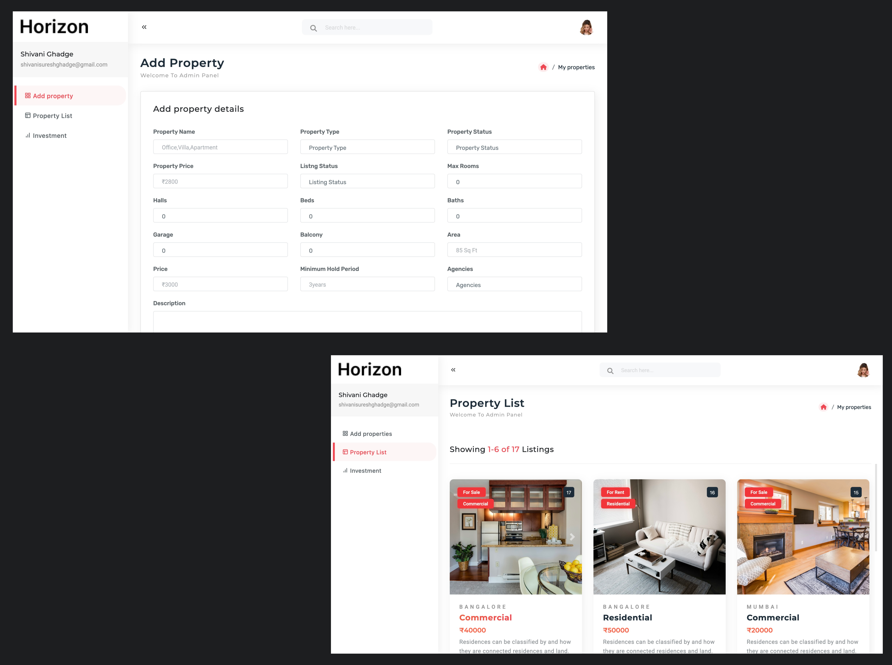

# Horizon Admin

Horizon Admin is a management tool for the Horizon real estate project. This website helps the admin to upload new properties by filling out a form and edit existing properties. The website is developed using React.js, Firebase, and Bootstrap, and is hosted on Vercel.

## Features

- **Add New Properties**: Admins can add new properties by filling out a form.
- **Edit Existing Properties**: Admins can edit details of existing properties.
- **Responsive Design**: Built with Bootstrap for a responsive and user-friendly interface.

## Technologies Used

- **React.js**: A JavaScript library for building user interfaces.
- **Bootstrap**: A CSS framework for developing responsive and mobile-first websites.
- **Firebase**: A backend platform providing real-time database and authentication services.
- **Vercel**: A platform for frontend frameworks and static sites, used to host the website.

## Hosted Website

You can view the live project [here](https://horizon-admin-nine.vercel.app/).
